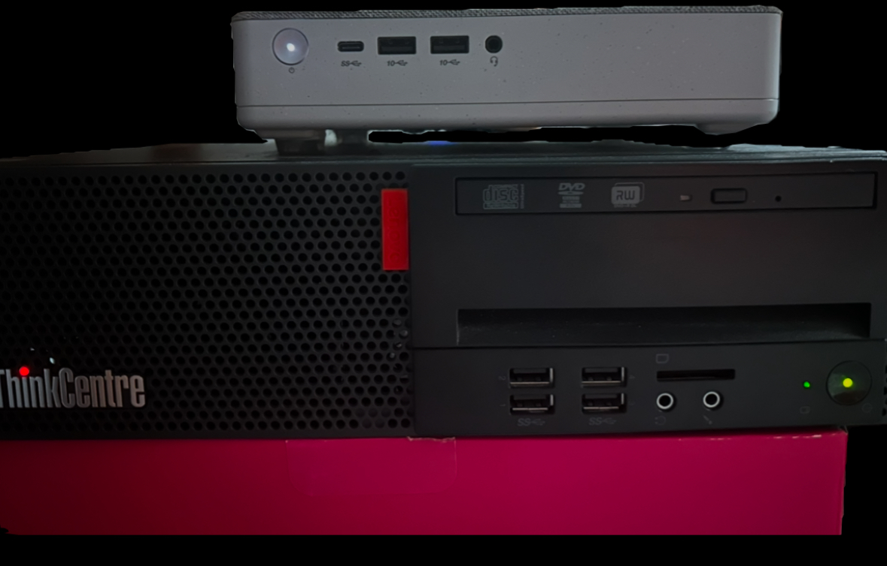

# 🖥️ Server Hardware

## Main Server (Lenovo IdeaCentre)
- **CPU:** Intel Core i5-12400T (12th Gen, 1.8 GHz, stromsparend)  
- **RAM:** 64 GB DDR4  
- **GPU:** Intel UHD Graphics 730  
- **Storage:** 1 TB Samsung NVMe SSD  
- **Einsatz:** Hauptserver für DayZ Hungerland (hohe Stabilität & Performance)  

## Backup Server (Lenovo ThinkCentre)
- **CPU:** Intel Core i5-6500 (6th Gen, 3.2 GHz)  
- **RAM:** 32 GB DDR4  
- **GPU:** Intel HD Graphics 530  
- **Storage:** 2 TB SanDisk SSD  
- **Einsatz:** Failover-System – übernimmt automatisch, falls der Main Server ausfällt  

---

⚡ **Highlights**  
- Beide Systeme laufen mit **unter 100W Verbrauch**  
- **Failover Ready** → Keine Downtime bei Ausfällen  
- Volle **Selbstkontrolle** über Updates, Backups und Monitoring  

